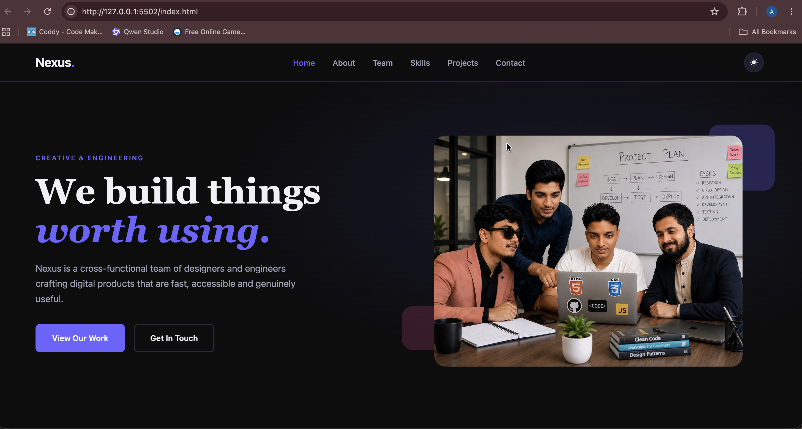
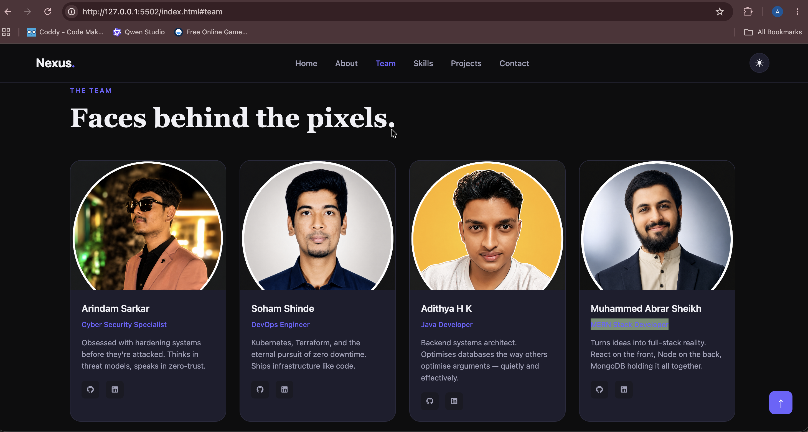
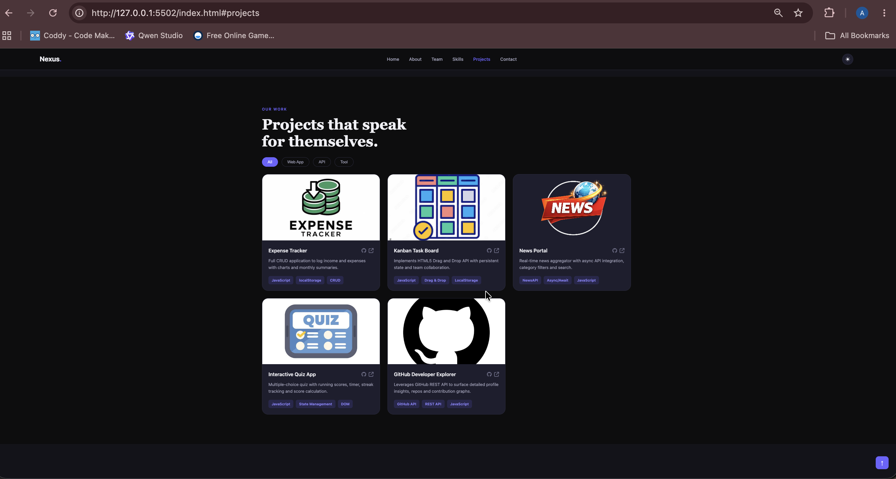

Nexus Team Agency Portfolio

A modern, responsive team portfolio website built using HTML, CSS, and JavaScript. This project showcases our team members, technical skills, and project portfolio through an interactive and visually appealing user interface.

🚀 Live Demo

Visit the live website:

https://abrarbuilds.github.io/The-Team-Agency-Portfolio/

📸 Preview

Nexus is a collaborative portfolio website designed to highlight:

* Team Members
* Technical Skills
* Featured Projects
* Contact Information
* Responsive Design
* Dark/Light Theme Support

✨ Features

* Fully Responsive Layout
* Dark & Light Mode Toggle
* Animated Scroll Reveal Effects
* Interactive Skill Progress Bars
* Project Filtering System
* Animated Statistics Counter
* Mobile Navigation Menu
* Contact Form Validation
* Back-to-Top Button
* Smooth Scrolling Navigation
* Modern UI/UX Design

🛠️ Built With

* HTML5
* CSS3
* JavaScript (ES6)
* Font Awesome Icons
* LocalStorage API
* Intersection Observer API

📂 Project Structure

Nexus-Team-Agency-Portfolio/
│
├── index.html
├── style.css
│
├── JS/
│   ├── nav.js
│   ├── theme.js
│   ├── animations.js
│   ├── projects.js
│   ├── contact.js
│   └── main.js
│
└── Screenshots/
    └── images

👥 Team Members

Arindam Sarkar

Cyber Security Specialist

Soham Shinde

DevOps Engineer

Adithya H K

Java Developer

Muhammed Abrar Sheikh

MERN Stack Developer

📌 Featured Projects

Expense Tracker

Track income and expenses with LocalStorage-based persistence and analytics.

Kanban Task Board

Task management application using drag-and-drop functionality.

News Portal

Real-time news aggregation using external APIs and asynchronous JavaScript.

Interactive Quiz App

Dynamic quiz platform with scoring and timer functionality.

GitHub Developer Explorer

Developer profile explorer powered by the GitHub REST API.

📱 Responsive Design

The website is optimized for:

* Desktop
* Laptop
* Tablet
* Mobile Devices

⚙️ Installation

Clone the repository:

git clone https://github.com/abrarbuilds/The-Team-Agency-Portfolio

Navigate to the project folder:

cd The-Team-Agency-Portfolio

Open index.html in your browser.

## 📸 Screenshots

### Home Page

### Team Section

### Projects Section

📈 Learning Outcomes

This project demonstrates:

* DOM Manipulation
* Event Handling
* Responsive Web Design
* API Integration
* LocalStorage Usage
* JavaScript Modules
* UI/UX Principles
* Frontend Project Architecture

🤝 Contributing

Contributions, suggestions, and improvements are welcome.

📄 License
MIT License

Copyright (c) 2026 Team Nexus

This project is open-source and available under the MIT License.

⸻

Built by Team Nexus.
